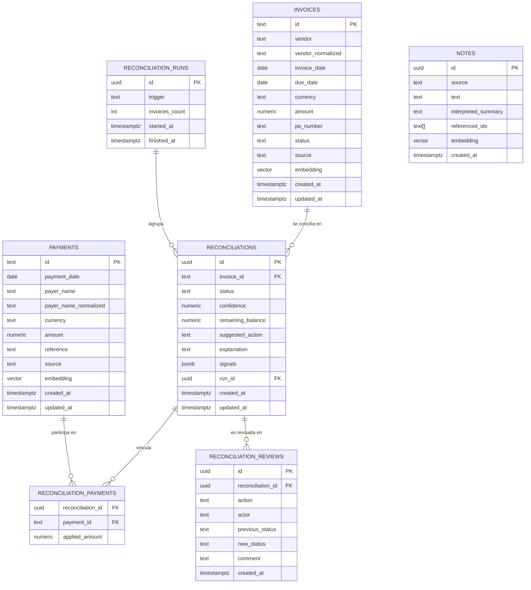

# Modelo Conceptual de Base de Datos — AI Reconciliation Assistant

Este documento describe el **modelo de datos a nivel conceptual** de la plataforma de
conciliación financiera asistida por IA. Es la fuente de verdad para el diseño de las
tablas de PostgreSQL (+ `pgvector`) y debe mantenerse alineado con el modelo de dominio
canónico definido en [`shared/types/domain.ts`](../../shared/types/domain.ts).

El esquema se implementa con **Kysely** (query builder type-safe de TypeScript). Los tipos
de las tablas viven en [`server/db/types.ts`](../../server/db/types.ts) y el esquema se crea
con migraciones en [`server/db/migrations/`](../../server/db/migrations/); ver la sección
[Implementación con Kysely](#implementación-con-kysely).

> PostgreSQL es la **fuente de verdad**. La IA solo **enriquece** información; el motor de
> conciliación es **determinístico** y toda decisión queda **auditada**.

---

## Principios de modelado

1. **El dominio manda.** Cada tabla materializa una entidad de `domain.ts`. Toda fuente
   (CSV, JSON, PDF, imagen, alta manual) se normaliza a estas tablas; el motor nunca conoce
   el origen.
2. **Auditable por diseño.** Una conciliación guarda sus señales (`signals`),
   `confidence`, `explanation` y `suggestedAction`. Las decisiones humanas se registran en
   una bitácora separada (audit trail).
3. **IA aislada.** Los campos producidos por IA (texto normalizado, embeddings,
   explicaciones) viven en columnas propias y nunca sustituyen el dato original.
4. **`pgvector` solo recupera candidatos.** Los embeddings sirven para *retrieval* de
   evidencia; las reglas deciden. Ninguna columna vectorial participa en el cierre de una
   conciliación.
5. **Extensible.** Agregar una fuente nueva no debe alterar el esquema del motor
   (`reconciliations`). El origen se captura en una columna `source`, no en tablas nuevas.

---

## Diagrama entidad-relación (conceptual)



---

## Tablas

### `invoices` — Invoice Pool

Materializa la entidad `Invoice`. Recibe datos desde CSV, OCR/PDF, imagen o alta manual.

| Campo | Tipo | Nulo | Descripción |
|---|---|---|---|
| `id` | `text` PK | No | Identificador de la factura tal como llega de la fuente (p.ej. `INV-1001`). |
| `vendor` | `text` | No | Nombre del proveedor **original**, sin limpiar. |
| `vendor_normalized` | `text` | Sí | Nombre normalizado (minúsculas, sin sufijos `LLC/SA/Inc`) para *matching*. Lo genera el pipeline de ingesta/IA. |
| `invoice_date` | `date` | No | Fecha de emisión de la factura. |
| `due_date` | `date` | No | Fecha de vencimiento. |
| `currency` | `text` (3) | No | Moneda ISO-4217 (`USD`, `MXN`, `EUR`, …). |
| `amount` | `numeric(14,2)` | No | Importe total de la factura. Nunca `float`: precisión monetaria exacta. |
| `po_number` | `text` | Sí | Número de orden de compra (purchase order). Señal fuerte de *matching*. |
| `status` | `text` | No | Estado operativo de la factura (`open`, `paid`, `closed`, …). |
| `source` | `text` | No | Origen del registro: `csv`, `ocr_pdf`, `ocr_image`, `manual`. Para trazabilidad. |
| `embedding` | `vector(1536)` | Sí | Embedding semántico del texto representativo de la factura (ver sección pgvector). |
| `created_at` | `timestamptz` | No | Fecha de alta. Default `now()`. |
| `updated_at` | `timestamptz` | No | Última modificación. Default `now()`. |

### `payments` — Payment Pool

Materializa la entidad `Payment`. Recibe datos desde CSV o alta manual.

| Campo | Tipo | Nulo | Descripción |
|---|---|---|---|
| `id` | `text` PK | No | Identificador del pago (p.ej. `PAY-9001`). |
| `payment_date` | `date` | No | Fecha del pago. |
| `payer_name` | `text` | No | Nombre del pagador **original** (puede traer typos). |
| `payer_name_normalized` | `text` | Sí | Nombre normalizado para comparar contra `vendor_normalized`. |
| `currency` | `text` (3) | No | Moneda ISO-4217 del pago. |
| `amount` | `numeric(14,2)` | No | Importe pagado. |
| `reference` | `text` | Sí | Referencia libre del pago (puede mencionar `INV-…`, `PO-…` o texto). Señal clave. |
| `source` | `text` | No | Origen: `csv`, `manual`. |
| `embedding` | `vector(1536)` | Sí | Embedding semántico del pago para *retrieval* de candidatos. |
| `created_at` | `timestamptz` | No | Fecha de alta. Default `now()`. |
| `updated_at` | `timestamptz` | No | Última modificación. Default `now()`. |

### `notes` — Notes Pool

Materializa `OperationalNote`. El dominio no define `id`; la base **sí** lo necesita como
clave primaria. Recibe datos desde JSON o alta manual.

| Campo | Tipo | Nulo | Descripción |
|---|---|---|---|
| `id` | `uuid` PK | No | Identificador interno generado (`gen_random_uuid()`). |
| `source` | `text` | No | Canal de origen: `email`, `slack`, `ops-note`, … |
| `text` | `text` | No | Contenido literal de la nota operativa. |
| `interpreted_summary` | `text` | Sí | Interpretación/resumen generado por la IA (enriquecimiento, opcional). |
| `referenced_ids` | `text[]` | Sí | IDs de facturas/POs detectados en la nota (extraídos por IA o regex). Acelera el cruce. |
| `embedding` | `vector(1536)` | Sí | Embedding semántico de la nota para recuperar notas relevantes a una factura. |
| `created_at` | `timestamptz` | No | Fecha de alta. Default `now()`. |

### `reconciliations` — Resultado del motor determinístico

Materializa `ReconciliationResult`. Una fila por factura conciliada en un *run*.

| Campo | Tipo | Nulo | Descripción |
|---|---|---|---|
| `id` | `uuid` PK | No | Identificador del resultado. |
| `invoice_id` | `text` FK → `invoices.id` | No | Factura conciliada. |
| `status` | `text` | No | Estado del enum `ReconciliationStatus`: `Matched`, `Partial Match`, `Needs Review`, `Unmatched`, `Suspicious`. |
| `confidence` | `numeric(5,4)` | No | Puntaje de confianza `0.0000`–`0.9999` producido por las reglas. |
| `remaining_balance` | `numeric(14,2)` | Sí | Saldo pendiente cuando aplica (parciales). `NULL` cuando no hay pago asociado. |
| `suggested_action` | `text` | No | Siguiente acción sugerida en lenguaje claro para el operador. |
| `explanation` | `text` | No | Explicación corta y legible. Puede ser redactada por IA a partir de las señales. |
| `signals` | `jsonb` | No | Arreglo de `EvidenceSignal[]` (`key`, `label`, `weight`, `matched`, `detail`). Evidencia auditable. |
| `run_id` | `uuid` FK → `reconciliation_runs.id` | Sí | Ejecución que produjo el resultado. |
| `created_at` | `timestamptz` | No | Fecha de generación. Default `now()`. |
| `updated_at` | `timestamptz` | No | Última modificación (p.ej. tras revisión humana). |

> `matchedPaymentIds` del dominio se modela como relación N:M en `reconciliation_payments`,
> no como columna, para preservar integridad referencial y permitir múltiples pagos por
> factura (parciales/duplicados).

### `reconciliation_payments` — Pagos vinculados a una conciliación (N:M)

Resuelve la relación muchos-a-muchos entre `reconciliations` y `payments`
(`matchedPaymentIds`).

| Campo | Tipo | Nulo | Descripción |
|---|---|---|---|
| `reconciliation_id` | `uuid` FK → `reconciliations.id` | No | Conciliación. |
| `payment_id` | `text` FK → `payments.id` | No | Pago vinculado. |
| `applied_amount` | `numeric(14,2)` | Sí | Importe del pago aplicado a esa factura (útil en parciales/repartos). |

Clave primaria compuesta: (`reconciliation_id`, `payment_id`).

### `reconciliation_runs` — Lote de ejecución (worker)

Agrupa los resultados de una corrida del motor, dejando preparado el diseño para un worker
desacoplado/cola.

| Campo | Tipo | Nulo | Descripción |
|---|---|---|---|
| `id` | `uuid` PK | No | Identificador del run. |
| `trigger` | `text` | No | Disparador: `import`, `manual`, `scheduled`. |
| `invoices_count` | `int` | Sí | Número de facturas procesadas. |
| `started_at` | `timestamptz` | No | Inicio de la ejecución. |
| `finished_at` | `timestamptz` | Sí | Fin de la ejecución. |

### `reconciliation_reviews` — Audit trail / revisión humana (bonus)

Bitácora inmutable de decisiones humanas sobre una conciliación. Soporta los estados de
revisión manual (approve, reject, duplicate, resolved) y el requisito de auditoría
(*quién* cambió *qué* y *cuándo*).

| Campo | Tipo | Nulo | Descripción |
|---|---|---|---|
| `id` | `uuid` PK | No | Identificador del evento de revisión. |
| `reconciliation_id` | `uuid` FK → `reconciliations.id` | No | Conciliación afectada. |
| `action` | `text` | No | Acción tomada: `approve`, `reject`, `duplicate`, `resolved`, `reopen`. |
| `actor` | `text` | No | Usuario/operador que ejecutó la acción. |
| `previous_status` | `text` | Sí | Estado antes del cambio. |
| `new_status` | `text` | Sí | Estado después del cambio. |
| `comment` | `text` | Sí | Justificación o nota del revisor. |
| `created_at` | `timestamptz` | No | Momento del evento. Default `now()`. Append-only. |

---

## pgvector — búsqueda semántica

`pgvector` habilita el *retrieval* de candidatos en la capa de evidencia. La extensión ya se
crea en [`server/db/init/01-extensions.sql`](../../server/db/init/01-extensions.sql)
(`CREATE EXTENSION IF NOT EXISTS vector;`) y la imagen `pgvector/pgvector:pg16` la provee.

### Columnas vectoriales

| Tabla | Columna | Tipo | Contenido del embedding |
|---|---|---|---|
| `invoices` | `embedding` | `vector(1536)` | `vendor` + `po_number` + `currency` + `amount` + `status` serializados a texto. |
| `payments` | `embedding` | `vector(1536)` | `payer_name` + `reference` + `currency` + `amount`. |
| `notes` | `embedding` | `vector(1536)` | `text` (y `interpreted_summary` si existe). |

### Dimensión del vector

- `vector(1536)` corresponde al modelo `text-embedding-3-small` de OpenAI (configurable vía
  `OPENAI_MODEL`/variables de entorno).
- La dimensión es **fija** una vez creada la columna. Si se cambia de modelo de embeddings,
  hay que migrar la columna (recrearla con la nueva dimensión y re-generar embeddings).
- Si no hay `OPENAI_API_KEY`, el proveedor de IA es *mock*: el embedding puede quedar `NULL`
  y el *retrieval* cae a las heurísticas determinísticas (referencia/monto/proveedor), sin
  romper el flujo.

### Índices vectoriales

Para datasets pequeños (el del reto) la búsqueda exacta basta. Para escalar se define un
índice aproximado. Se usa **HNSW** (mejor recall/latencia que IVFFlat y no requiere
`training`). Estos índices se crean con SQL crudo dentro de la migración de Kysely (el tipo
`vector` y el método `hnsw` no forman parte del schema builder):

```sql
-- Distancia coseno (normaliza por magnitud; adecuada para embeddings de texto)
CREATE INDEX ON invoices USING hnsw (embedding vector_cosine_ops);
CREATE INDEX ON payments USING hnsw (embedding vector_cosine_ops);
CREATE INDEX ON notes    USING hnsw (embedding vector_cosine_ops);
```

Operadores de distancia disponibles: `<->` (L2), `<#>` (producto interno negativo),
`<=>` (coseno). Para texto se usa **coseno** (`<=>` / `vector_cosine_ops`).

### Patrón de consulta (retrieval de candidatos)

```sql
-- Recuperar los N pagos más parecidos a una factura.
-- pgvector SOLO propone candidatos; el motor de reglas decide el match final.
SELECT id, payer_name, amount, reference,
       embedding <=> $1 AS distance
FROM payments
WHERE embedding IS NOT NULL
ORDER BY embedding <=> $1
LIMIT 20;
```

---

## Índices y restricciones recomendados (no vectoriales)

| Tabla | Índice / restricción | Motivo |
|---|---|---|
| `invoices` | `idx_invoices_po_number` (`po_number`) | *Matching* por PO. |
| `invoices` | `idx_invoices_vendor_normalized` | Similitud de proveedor. |
| `payments` | `idx_payments_reference` | *Matching* por referencia. |
| `payments` | `idx_payments_amount` | Cruce por monto. |
| `reconciliations` | `idx_recon_invoice_id` (`invoice_id`) | Última conciliación por factura. |
| `reconciliations` | `idx_recon_status` (`status`) | Filtros del dashboard (Mission Control). |
| `reconciliation_payments` | PK (`reconciliation_id`, `payment_id`) | Evita duplicar vínculos. |
| `reconciliation_reviews` | `idx_reviews_recon_id` | Historial por conciliación. |

---

## Relación con el modelo de dominio

| Tabla | Tipo en `domain.ts` | Notas |
|---|---|---|
| `invoices` | `Invoice` | `+ vendor_normalized`, `source`, `embedding`, timestamps. |
| `payments` | `Payment` | `+ payer_name_normalized`, `source`, `embedding`, timestamps. |
| `notes` | `OperationalNote` | `+ id`, `interpreted_summary`, `referenced_ids`, `embedding`. |
| `reconciliations` | `ReconciliationResult` | `matchedPaymentIds` → `reconciliation_payments`; `signals` → `jsonb`; `+ run_id`. |
| `reconciliation_payments` | (deriva de `matchedPaymentIds`) | Relación N:M. |
| `reconciliation_runs` | (infraestructura del worker) | No existe en dominio; soporte de auditoría/lotes. |
| `reconciliation_reviews` | (bonus: manual review + audit trail) | No existe en dominio; bitácora append-only. |

> `ReconciliationSummary` no se persiste: es un agregado de lectura que se calcula sobre
> `reconciliations` para el dashboard.

---

## Implementación con Kysely

El modelo se implementa con **Kysely** (query builder type-safe) sobre **node-postgres**
(`pg`). Kysely no es un ORM: se escriben consultas SQL tipadas a partir de la interfaz
`Database`, lo que mantiene el control del SQL (clave para `pgvector`) sin perder seguridad
de tipos.

### Mapa de archivos

| Archivo | Responsabilidad |
|---|---|
| [`server/db/types.ts`](../../server/db/types.ts) | Interfaz `Database` y tipos por tabla. Contrato que tipa todas las consultas. |
| [`server/db/client.ts`](../../server/db/client.ts) | Instancia Kysely (`useDb()`), pool `pg` reutilizado en el hot-reload de Nitro. |
| [`server/db/migrations/`](../../server/db/migrations/) | Migraciones versionadas (`up`/`down`) con el schema builder de Kysely. |
| [`server/db/migrate.ts`](../../server/db/migrate.ts) | Runner de migraciones (`Migrator` + `FileMigrationProvider`). |
| [`server/db/init/01-extensions.sql`](../../server/db/init/01-extensions.sql) | Habilita la extensión `vector` al inicializar el contenedor. |
| [`server/repositories/`](../../server/repositories/) | Acceso a datos por entidad; mapean fila ↔ dominio. |

### Scripts (package.json)

| Comando | Acción |
|---|---|
| `pnpm db:migrate` | Aplica las migraciones pendientes (`migrateToLatest`). |
| `pnpm db:migrate:down` | Revierte la última migración (`migrateDown`). |
| `pnpm db:seed` | Reinicia los pools y los siembra desde `data/samples`. |

### `pgvector` en Kysely

- Las columnas `embedding` se crean con SQL crudo en la migración:
  `.addColumn('embedding', sql\`vector(1536)\`)`.
- Los índices HNSW se crean con `sql\`CREATE INDEX ... USING hnsw (embedding vector_cosine_ops)\`.execute(db)`.
- En la interfaz `Database`, `embedding` se tipa como `string | null` y se serializa al
  formato pgvector (`'[0.1, 0.2, ...]'`) al persistir.
- La **extensión** `vector` la habilita el SQL de init del contenedor; la migración además
  ejecuta `CREATE EXTENSION IF NOT EXISTS vector` por idempotencia.

### Tipado y mapeo

`types.ts` define los tipos de fila; Kysely deriva `Selectable`/`Insertable` por tabla. Los
repositorios traducen entre esas filas y las entidades de `domain.ts` (p.ej. `numeric` →
`number`, `jsonb` ↔ `EvidenceSignal[]`). El motor de conciliación sigue trabajando solo con
tipos de dominio.

---

## Notas de diseño

- **Tipos monetarios:** siempre `numeric`, nunca `float`/`double`, para evitar errores de
  redondeo en saldos y conciliaciones.
- **Campos originales vs. normalizados:** se conserva el dato crudo (`vendor`,
  `payer_name`, `reference`) y se agregan columnas normalizadas/enriquecidas aparte. El
  enriquecimiento por IA nunca pisa el original.
- **`signals` como `jsonb`:** mantiene la evidencia auditable junto al resultado sin crear
  una tabla por señal; el esquema de `EvidenceSignal` puede evolucionar sin migraciones.
- **Append-only en auditoría:** `reconciliation_reviews` no se actualiza ni borra; cada
  decisión humana es un nuevo registro.
- **Idempotencia del worker:** una nueva corrida genera nuevas filas en `reconciliations`
  asociadas a un `run_id`; la "última conciliación" de una factura se obtiene por
  `invoice_id` + `created_at` más reciente.
```
